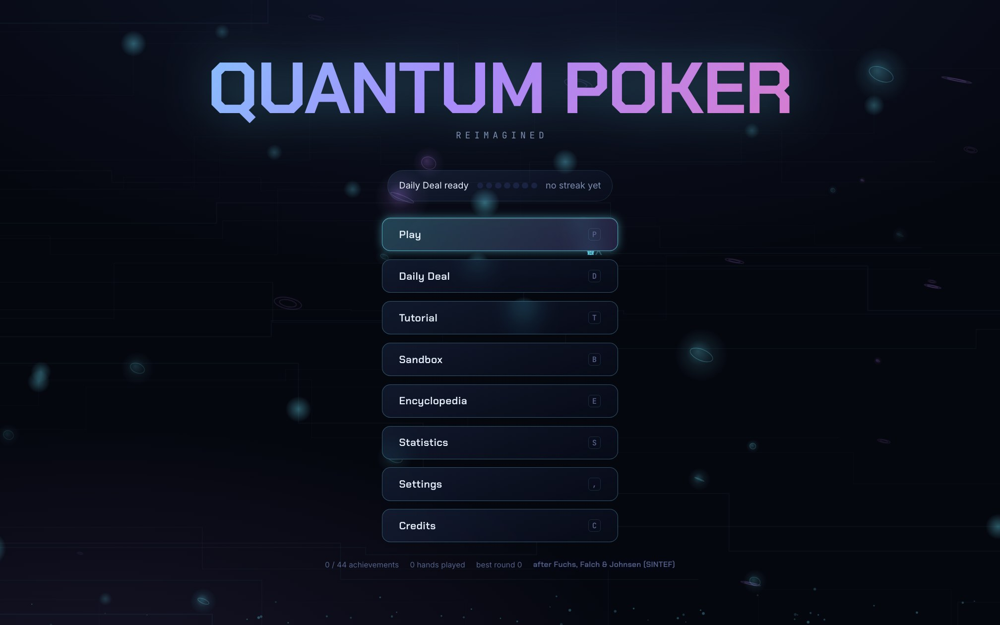
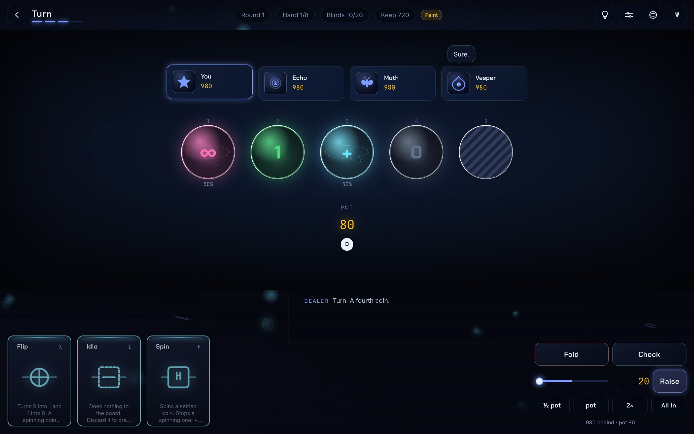
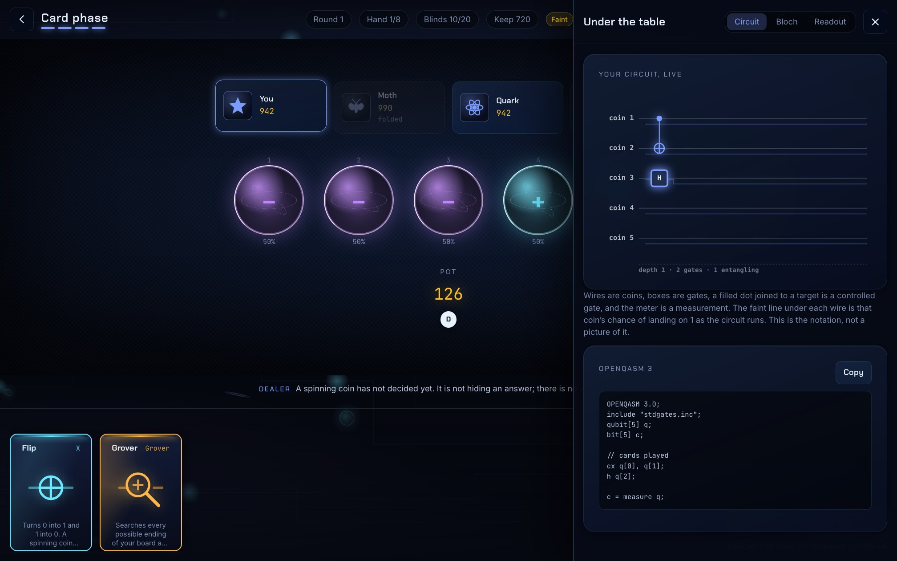
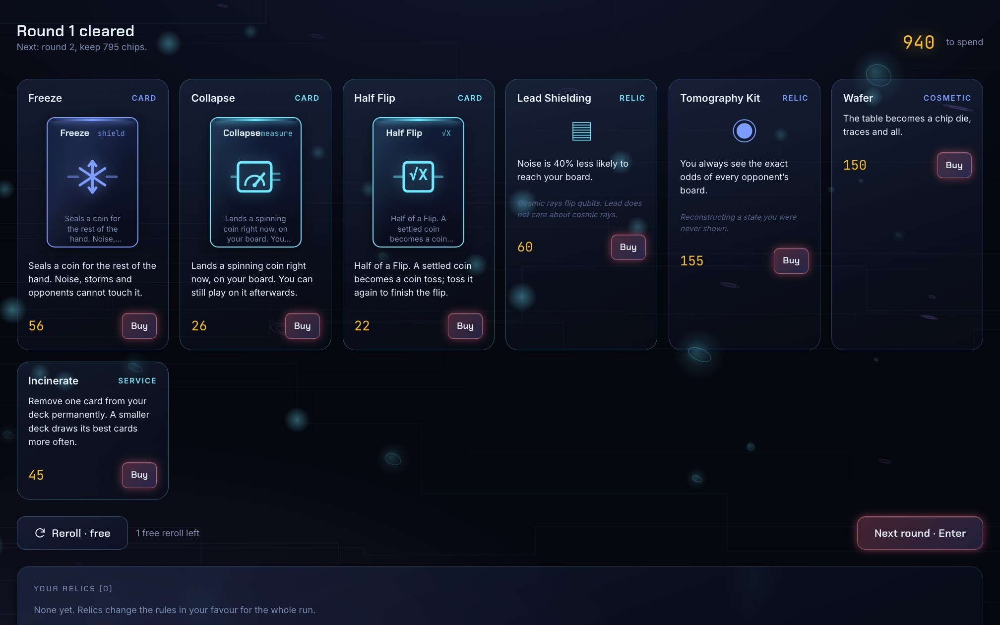
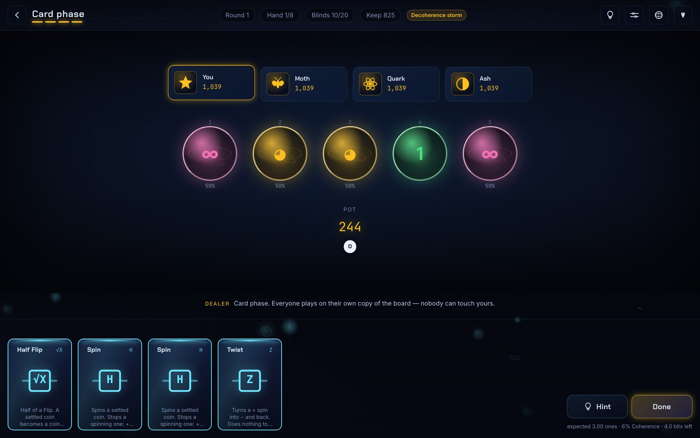
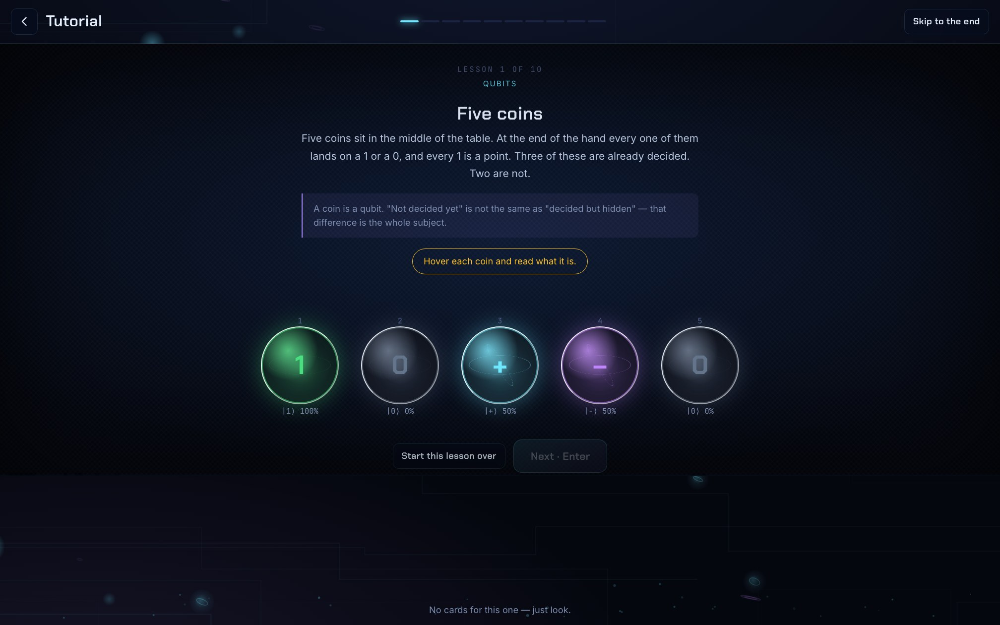
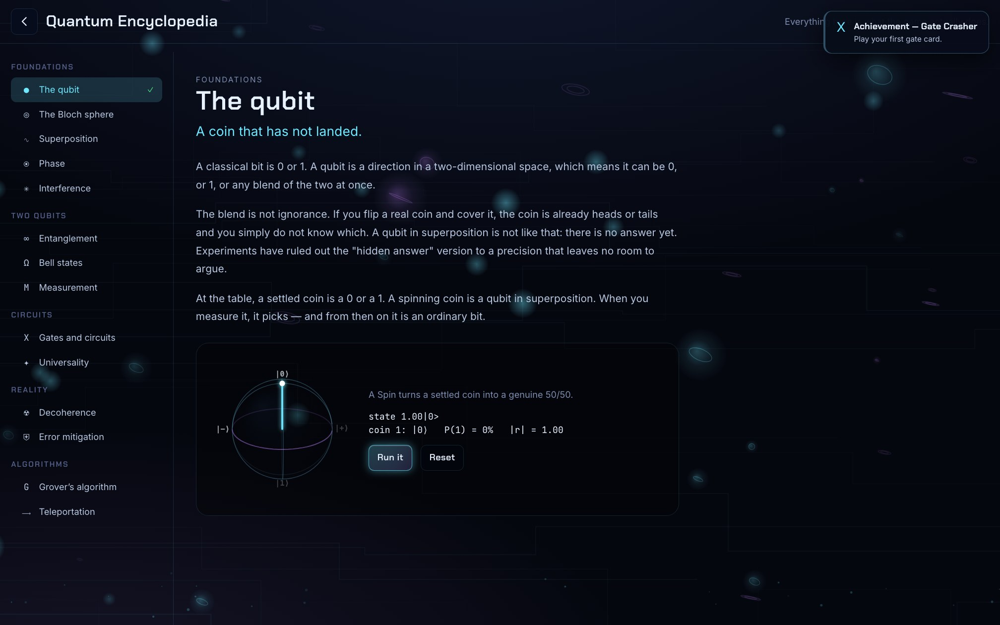
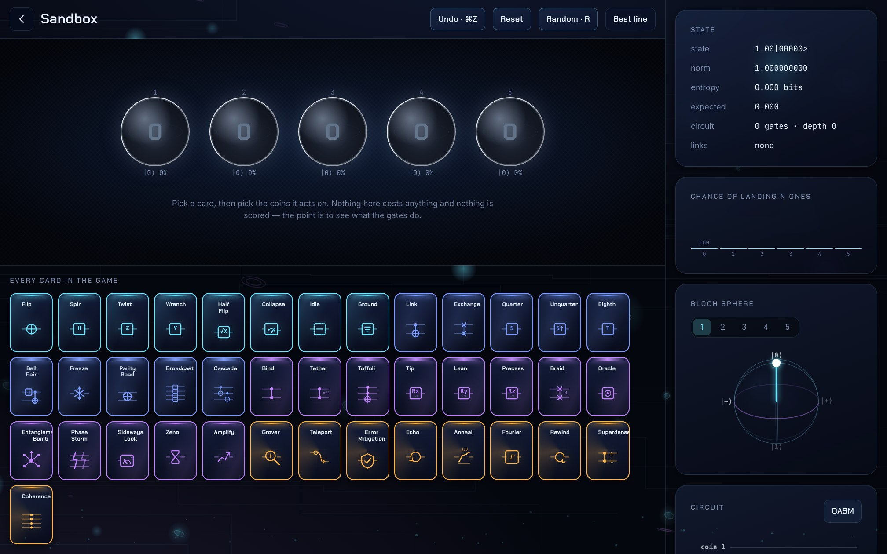
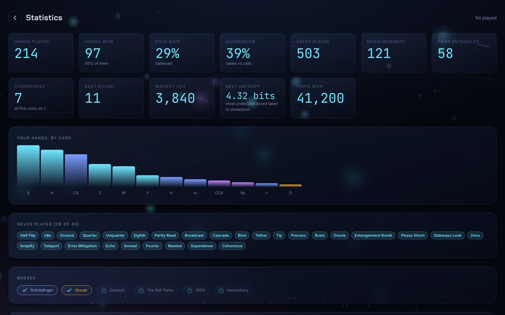
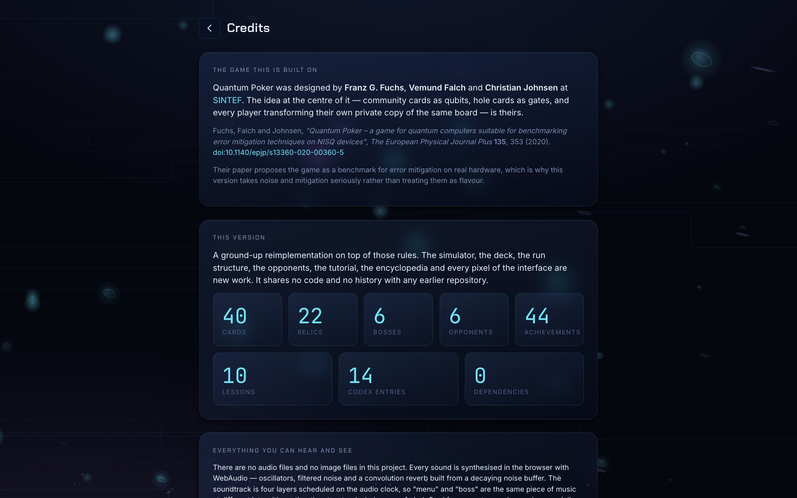

# Quantum Poker — Reimagined

**Texas Hold'em where the community cards are five qubits and your hand is a set of quantum gates.**
Runs in a browser. No install, no account, no build step, no dependencies.

The board is a genuine state-vector simulation — 2ⁿ complex amplitudes with the real gate
matrices applied to them. Every probability on the table is the honest quantum answer, and
`tools/verify_with_qiskit.py` proves it by replaying the same circuits through Qiskit.



---

## Play it

```bash
git clone https://github.com/abenehra21/QuantumPoker-Reimagined.git
cd QuantumPoker-Reimagined
python3 tools/serve.py 8000      # then open http://localhost:8000
```

Any static server works — `npx serve`, `php -S`, GitHub Pages. There is nothing to build
and nothing to install. (`tools/serve.py` is just `http.server` with caching turned off,
which matters while you are editing.)

```bash
npm test          # 178 self-checks, in Node
npm run check     # module, layering, CSS and asset checks
```

Or open `index.html?test` and read the console.

---

## The rules in ninety seconds

Five **coins** sit in the middle of the table. At showdown each one lands on a **1** or a **0**.
Every 1 is a point, most points wins the pot, and in between you bet chips exactly as in Hold'em.

### Reading a coin

| Coin | Means | Chance of a 1 |
|---|---|--:|
| **1** | Settled. A sure point. | 100% |
| **0** | Settled. Worthless unless you change it. | 0% |
| **spinning +** | Undecided — a qubit in superposition, tilted `+`. | 50% |
| **spinning −** | Undecided, tilted `−`. The tilt decides what your cards do to it. | 50% |
| **tilted** | At some other angle entirely. Rotation cards make these. | anything |
| **linked** | Entangled. It has no value of its own; only the pair does. | 50% |

### Your cards

Three or four per hand, dealt before the first bet, private to you. Each one is a quantum gate.

| Card | Does | Gate |
|---|---|---|
| **Flip** | Turns 0 into 1 and 1 into 0. A spinning coin ignores it. | `X` |
| **Spin** | Spins a settled coin. Stops a spinning one: `+` lands on 0, `−` lands on 1. | `H` |
| **Twist** | Turns a `+` spin into `−` and back. Invisible until something reads it. | `Z` |
| **Link** | If the first coin is 1, flips the second. If it is spinning, entangles them. | `CNOT` |
| **Collapse** | Lands a spinning coin *now*, on your board. You can still play on it. | measurement |

…and thirty-five more, up to Grover, Teleport and the Quantum Fourier Transform.

### A hand

1. **Deal** — blinds, cards each, first bets. No coins showing: you are betting on your cards.
2. **Flop** — three coins turn over. Bets. **Turn** — a fourth. **River** — the fifth.
3. **Card phase** — everyone still in plays their cards on **their own copy** of the board.
4. **Showdown** — every copy lands at once. Count the 1s.

| 1s | Rank |
|--:|---|
| 0 | Blank |
| 1 | One |
| 2 | Pair |
| 3 | Trips |
| 4 | Quads |
| 5 | **Coherence** |

Tied on count? A 1 further left wins — coin 1 is the ace. Identical boards split the pot.



---

## Why it is a quantum project and not a theme

Nothing here is decorative. The card art *is* the circuit notation, and the circuit the
player builds is a real one.

- **`src/quantum/state.js`** is an exact state-vector simulator: `X`, `Y`, `Z`, `H`, `S`, `T`,
  `Rx`, `Ry`, `Rz`, phase, `CX`, `CZ`, controlled-phase, `SWAP`, Toffoli and multi-controlled `Z`,
  plus projective measurement. Bloch vectors come from the reduced density matrix, so an
  entangled coin's arrow genuinely shortens — its length *is* the purity.
- **Spinning** is superposition. The ± tilt is relative phase, which changes no probability
  at all until a gate converts it into an outcome. That conversion is **interference**, and
  Twist-then-Spin is the shortest demonstration of it anyone has built into a card game.
- **Linked** coins are Bell pairs, detected by projecting each pair onto all four Bell states.
  Weaker correlations are drawn as fainter arcs, measured by the **mutual information** of the
  two coins' outcomes — how much knowing one tells you about the other.
- **Collapse** is a projective measurement: the disagreeing branch is deleted and the rest
  renormalised. It is why **Rewind**, which undoes any gate, refuses to undo a Collapse.
- **Noise** is six Kraus-sampled channels — bit flip, phase flip, depolarising, amplitude
  damping (T1), dephasing (T2) and crosstalk — and the **Error Mitigation** card performs real
  zero-noise extrapolation, which the test suite verifies actually beats the raw estimate.



Press **C** at the table and watch the diagram assemble itself as you play. Copy the
OpenQASM 3 and it runs unmodified on IBM hardware.

### Verified against Qiskit

```bash
pip install -r requirements.txt
node tools/dump_states.js 500 > /tmp/states.json
python3 tools/verify_with_qiskit.py /tmp/states.json
```

```
500/500 random circuits match Qiskit to a fidelity of 1 - 1e-09
29/29 deck cards do in Qiskit exactly what their circuit notation says
```

That second line found five real bugs while it was being written: cards that changed the
board in ways their own recorded circuit did not reproduce. A self-check now asserts the
property directly, so it cannot come back.

---

## What you can do with it

### Modes

| Mode | What it is |
|---|---|
| **Casual** | Gentle opponents, no noise, generous stacks. |
| **Quantum Student** | Balanced opponents, a faint hum of decoherence. The intended game. |
| **Quantum Master** | Opponents run the same search you do, at full width. Real NISQ-level noise. |
| **Chaos** | A random quantum event every street: storms, cascades, cosmic rays, cooling cycles. |
| **Experimental** | Boards dealt at arbitrary rotations. No coin is a clean plus or minus any more. |
| **Endless** | Difficulty, noise and opponent skill all climb. A boss every fifth round. |
| **Daily Deal** | Ten hands, one seed, one attempt. The same deals for everyone on Earth today. |
| **Sandbox** | Every card, unlimited, with undo and live probabilities. |

A run is a sequence of rounds. Survive a round's chip target and you go shopping; fall short
and the run ends. The targets are calibrated against forty simulated runs rather than guessed:
poker is zero-sum, so asking for a profit every round would make a run unwinnable. The median
run reaches round 4; the top tenth reach 10 or more.



### Forty cards, twenty-two relics, six bosses

Cards run from the Clifford basics through rotation gates to named algorithms. Relics are
permanent run upgrades resolved through hooks rather than engine special cases — *Surface Code*
grants total noise immunity, *Schrödinger's Chip* gives you a coin flip when you would bust,
*No-Cloning Theorem* stops opponents holding a card you hold.

Bosses are one opponent plus one announced rule. Schrödinger deals every coin spinning.
Deutsch sees your board exactly, all hand. Heisenberg hides your own probabilities from you.
The Bell Twins take two seats and share one board.



### Learning it

The **tutorial** is ten lessons, each handing you a rigged board and exactly the cards that
make one idea obvious. Nothing is explained before you have watched it happen. The self-checks
solve every lesson by exhaustive search, so a lesson can never ship unsolvable.



A **dealer** narrates every phase under the table in the plainest words available — what
this street is *for*, not what just happened — and names the concept the moment you first
cause it. Play Twist then Spin and it tells you that was interference, because you have just
watched interference rather than read about it.

The **encyclopedia** is fourteen illustrated entries with a runnable demo on each — press Run
and watch the state move on a Bloch sphere.



The **sandbox** is the whole deck with undo, a live circuit, a Bloch sphere and the full
outcome distribution. It is the screen to project in a lecture.



### Progress

Forty-four achievements, a statistics dashboard, unlockable cosmetics, a Daily Deal streak.
Everything is stored in your own browser and nowhere else; there is no account and no server.



---

## Controls

| Key | Does |
|---|---|
| `1`–`9` | Pick a card, then pick coins |
| `F` | Fold |
| `Space` / `Enter` | Call, check, or continue |
| `H` | Hint — the best line, from the same planner the bots use |
| `C` | Circuit view |
| `B` | Bloch sphere |
| `P` | Show every coin's ket and probability |
| `M` | Mute |
| `Esc` | Cancel, close, or go back |

From the menu: `P` play, `D` daily, `T` tutorial, `B` sandbox, `E` encyclopedia, `S` stats,
`C` credits, `,` settings.

Everything is reachable by keyboard and every control is labelled for a screen reader.

---

## Accessibility

- **Four colour-vision modes** (protanopia, deuteranopia, tritanopia, monochrome). These are
  not filters over the page — they retune the six coin colours and four rarities so that every
  pair you must tell apart differs in lightness as well as hue.
- **Reduced motion** at two levels, honoured from the OS as well as the settings screen. Every
  animation in the game goes through one tween layer, so this is a setting rather than an audit.
- **Text scaling** from 0.85× to 1.6×, applied to every piece of text.
- **Individual switches** for glow, screen shake and chromatic aberration.
- Coins carry a shape and a symbol as well as a colour; nothing is colour alone.

---

## Architecture

```
QuantumPoker-Reimagined/
├── index.html              the only page
├── src/
│   ├── quantum/            state.js  read.js  noise.js  circuit.js
│   ├── gameplay/           cards.js  planner.js  game.js  run.js  relics.js
│   │                       status.js  modes.js  bosses.js  shop.js
│   ├── ai/                 personalities.js  brain.js  dialogue.js
│   ├── engine/             loop.js  tween.js  events.js
│   ├── render/             bloch.js  circuit.js  background.js  art.js
│   ├── effects/            particles.js  vfx.js
│   ├── audio/              synth.js  sfx.js  music.js
│   ├── save/               store.js  achievements.js
│   ├── tutorial/           lessons.js  codex.js
│   ├── ui/                 app.js  router.js  dom.js  tooltip.js  toast.js
│   │   ├── components/     card.js  orb.js  seat.js
│   │   └── screens/        menu modes table shop tutorial sandbox
│   │                       codex stats settings results inspector
│   └── utils/              rng.js
├── styles/                 tokens.css  base.css  components.css  screens.css
├── tests/run.js            178 self-checks
├── tools/                  serve.py  check.js  shots.js
│                           dump_states.js  verify_with_qiskit.py
└── assets/                 empty on purpose — see assets/README.md
```

One rule holds the whole thing together, and `npm run check` enforces it:

> **`quantum/`, `gameplay/`, `ai/`, `save/`, `tutorial/` and `utils/` may not import from
> `ui/`, `render/`, `effects/` or `audio/`, and may not touch the DOM.**

That is why the entire game runs headless in Node. The test suite plays twenty-five complete
games against the bots and checks that not one chip goes missing, and forty simulated runs
finish in under two seconds — neither would be possible if the rules knew about the screen.

A few decisions worth naming:

- **The planner is expectimax, not a beam search.** The player maximises at every choice and
  chance averages at every measurement. Written as a flat beam it had two bugs that both
  looked like features: it dropped the minority branch of a gamble, reporting a coin flip as a
  certainty, and it could not express "Collapse, then Flip only if it landed wrong" at all.
  Search width is now the difficulty dial, and a wider search provably never plans worse.
  One planner serves both the Hint button and every bot, so the hint is never advice the
  machine would not take itself.
- **The table drains an event queue.** The engine emits; the table animates one event at a
  time with the game paused in between. Without that, a bot's three actions all land on the
  same frame and the table looks like a spreadsheet.
- **The frame loop sheds work.** Three long frames in a row and the particle budget halves; a
  run of comfortable frames earns it back. A slow machine loses sparkle instead of frame rate.
- **No build step, ever.** ES modules, `import`, done. Edit a file and reload.

---

## Roadmap

Architecturally ready, not yet built:

- **Multiplayer.** The engine is deterministic from `(seed, handNo)` and takes actions through
  a small interface, so a networked game is a transport and a lobby, not a rewrite.
- **Replays and spectating.** Every hand already records its full circuit and the seed that
  produced it, which is all a replay needs.
- **Leaderboards.** The Daily Deal is one seed for everyone and the result is already a
  structured object.
- **More bosses and a second deck tier.** Both are data files.

---

## Credits

Quantum Poker was designed by **Franz G. Fuchs**, **Vemund Falch** and **Christian Johnsen** at
[SINTEF](https://www.sintef.no/). The core idea — community cards as qubits, hole cards as
gates, each player transforming their own copy of the board — is theirs:

> Fuchs, Falch and Johnsen, *"Quantum Poker – a game for quantum computers suitable for
> benchmarking error mitigation techniques on NISQ devices"*, **The European Physical Journal
> Plus 135**, 353 (2020). [doi:10.1140/epjp/s13360-020-00360-5](https://doi.org/10.1140/epjp/s13360-020-00360-5)

This is a ground-up reimplementation on top of their rules: the simulator, the forty-card deck,
the run structure, the opponents, the tutorial, the encyclopedia and every pixel of the
interface are new work. It is a spiritual successor, not a fork, and shares no history with
any earlier repository.



Licensed under the **GNU GPL v3**, like the original.
